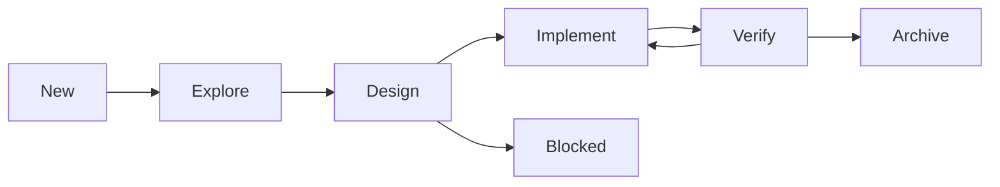

# berth AI Native Workflow Harness 设计文档

- 状态: 已批准设计, 待实现
- 日期: 2026-05-29
- 来源: [AI Native Workflow](https://confluence.shopee.io/display/SPFOODY/AI+Native+Workflow) (pageId 3204890129)
- 参考: OpenAI Harness Engineering, Anthropic Effective Harnesses, OpenSpec

## 1. 背景与目标

源文档基于 OpenAI Harness Engineering 的核心命题「Humans steer. Agents execute.」, 提出在模型能力确定的前提下, 用工程基础设施提高 Agent 产出的可预测性, 并最小化人工介入。文档识别四类共性问题: 描述模糊, 隐知识难以共享, 验证手段缺失, 跨会话交接困难。

本设计将该工作流体系落地到 berth 项目 (Electron 桌面应用, 见 `docs/ARCHITECTURE.md`), 产出一套自包含于仓库、同时兼容 Claude Code 与 Codex 两种 Agent 工具的 harness 框架。

落地深度: 四设施完整建设 + 四阶段流程 + OpenSpec 风格命令封装 + 可执行强制 (校验器 + CI)。范围内不含绕过人工门禁的全自动编排; 文档中「观测」一节标记为 v2, 本期仅留占位。

## 2. 源文档体系映射

### 2.1 四类设施

| 设施 | 文档要求 | berth 落地 |
|---|---|---|
| 指令 | Project Map; 渐进式披露; AGENTS.md < 500 行; 结构化; 唯一来源; 规则化 | `AGENTS.md` 增 Harness 索引章节 + 新建 `docs/ARCHITECTURE.md` |
| 工具 | 向 Agent 暴露 CLI/MCP, 让其主动获取上下文 | `.agents/tools.md` 仅列 berth 自用工具 |
| 状态 | 受 OpenSpec 启发, 每任务一份任务清单, 命名 `{DATE}-{JIRA}-{SUMMARY}` | `docs/works/{date}[-{jira}]-{summary}/` |
| 反馈 | Code Review + 工程摩擦; 机械检查交 CI; 不通过回写 PLAN | CI + PR 模板 + `opsx-verify` + `docs/friction/` |

### 2.2 四阶段流程

`Explore -> Design -> Implementation -> Verify`, 相邻步骤靠任务清单交接而非会话记忆。人类集中在两处介入: design 澄清意图, verify 确认验收。

### 2.3 封装

OpenSpec 风格自定义命令, 以 Jira Task ID 串联上下文, 流程绑定到一系列 skill, 通过斜杠命令触发。命令全集: `new, continue, explore, design, implement, verify, archive, optimization`。

## 3. 现状基线

### 3.1 已具备

- `AGENTS.md` (项目指令, 含 behavioral guidelines)
- `CLAUDE.md` 仅含 `@AGENTS.md` 引用
- `plans/` (任务计划), `issues/` (bug 跟踪), 各含 AGENTS.md 约定
- `docs/` (index.html, user-manual.md, CONTRIBUTING.md, prd/)
- `tests/` (Vitest 单测 + Playwright e2e stub)
- GitHub remote: `Caldis/berth`

### 3.2 缺失

- 无 `.claude/` 与 `.codex/` (无命令/skill)
- 无 `.github/workflows/` (无 CI)
- 无 `docs/ARCHITECTURE.md` (无 Project Map)
- 无 `docs/works/` 与 `docs/friction/`
- 无任务文档模板 (ANALYSIS/SPEC/PLAN)
- `package.json` 无 `packageManager` 字段

### 3.3 现状冲突

berth 现有 `plans/` 采用 `{DATE}-{SHORT_DESC}` 命名, `issues/` 存 bug, 与源文档的 `works/{DATE}-{JIRA}-{SUMMARY}` + `friction/` 命名与结构不一致, 需调和 (见第 11 节)。

## 4. 架构决策: 单一真源 + 双工具分发

### 4.1 工具行为核实结论

实现机制经官方一手来源核实, 结论如下 (含置信度):

1. Claude Code `.claude/commands/` 子目录命名空间在不同资料与版本中存在不一致。当前实现不依赖冒号命名空间, 改用 `.claude/commands/opsx-<verb>.md` 扁平命名。
2. Claude Code `.claude/commands/` 不跟随符号链接 (GitHub issue 39475, 10573)。置信中。故命令桩须复制而非软链。
3. Claude Code `.claude/skills/` 可用软链, 但 Windows checkout 可能把 Git symlink 落成普通文本文件。当前实现允许软链或目录副本。
4. Codex custom prompts 已废弃并在 HEAD 删除 (commit 48144a7), 且仅支持全局 `~/.codex/prompts/`, 无项目级。官方文档建议改用 skills。置信高。
5. Codex repo 级 skills 当前入口是 `.agents/skills/<name>/SKILL.md`, 从当前目录向仓库根逐级发现。项目不再分发 `.codex/skills`。
6. 两工具均原生读取仓库根 `AGENTS.md`。置信高。

### 4.2 决策

由证据收敛: skill 是两工具唯一对称的载体。故单一真源以 skill 指针形式存放于 `.agents/`; Codex 直接读取 `.agents/skills`; Claude Code 通过 `.claude/skills` 的软链或目录副本读取。真正的操作性 playbook 抽到 `.agents/workflow/`, skill 仅作薄指针 (贯彻文档「唯一性」原则)。

为兼容 Claude Code 的命令入口, 额外复制薄命令桩到 `.claude/commands/opsx-<verb>.md` (因 commands 不跟随软链, 只能复制; 命令桩静态, 由同步脚本生成)。

调用形态:

| 工具 | 主通道 | 次通道 |
|---|---|---|
| Claude Code | `/opsx-<verb>` (命令或 skill) | 无 |
| Codex | `$opsx-<verb>` skill | 无 |

## 5. 目录结构

```
berth/
├── .agents/                                   # 单一真源 (工具无关)
│   ├── README.md                              # 体系总览 + 观测占位 (v2)
│   ├── tools.md                               # berth 自用工具索引
│   ├── workflow/                              # 真 playbook (唯一真源)
│   │   ├── _shared.md                         # 门禁 + 状态契约 + 命名规范
│   │   ├── new.md          continue.md
│   │   ├── explore.md      design.md
│   │   ├── implement.md    verify.md
│   │   └── archive.md      optimization.md
│   └── skills/                                # 薄指针 skill (Codex 直接读取, Claude 分发源)
│       └── opsx-<verb>/SKILL.md               # 共 8 个
│
├── .claude/
│   ├── skills/opsx-<verb>                     # symlink 或目录副本 x8
│   └── commands/opsx-<verb>.md                # 复制的命令桩 x8 -> /opsx-<verb>
│
├── scripts/
│   ├── harness-sync.mjs                       # 幂等生成 Claude skill 分发 + 命令桩
│   └── harness-check.mjs                      # 校验任务产物/模板/命名/分发
│
├── docs/
│   ├── ARCHITECTURE.md                        # Project Map (新建)
│   ├── works/                                 # 任务工作区 (状态设施)
│   │   ├── _template/
│   │   │   ├── INDEX.md     00-PRD.md   00-BUG.md
│   │   │   ├── 01-ANALYSIS.md  02-SPEC.md  03-PLAN.md
│   │   ├── _archive/
│   │   └── {YYYY-MM-DD}[-{JIRA}]-{SUMMARY}/
│   └── friction/                              # 工程摩擦 (反馈设施)
│       ├── _template.md
│       ├── _archive/
│       └── {YYYYMMDD}-{phase}-{SUMMARY}.md
│
├── .github/
│   ├── workflows/ci.yml                       # lint + typecheck + test + harness:check
│   └── pull_request_template.md
│
├── tests/harness/check.test.ts               # 校验器单测
└── package.json                              # + packageManager + harness:check/sync
```

## 6. 四设施详细落地

### 6.1 指令

`AGENTS.md` 增加 Harness 索引章节, 仅暴露入口 (链接到 `.agents/README.md`, `docs/ARCHITECTURE.md`, `docs/works/`, `docs/friction/`), 不内联展开, 保持总行数 < 500。

新建 `docs/ARCHITECTURE.md` 作为 Project Map, 内容覆盖:

- 进程边界: main / preload / renderer / shared
- 模块边界: adapters (Claude Code 扫描器) / engine (扫描、监听、搜索) / ipc (handler 注册)
- IPC 契约: 16 个 handler 与 contextIsolation 约定
- 数据模型: Asset model 与 scope merge 规则
- 安全约束: read-only, 凭证隔离, 路径白名单

### 6.2 工具

`.agents/tools.md` 仅列 berth 实际可用工具, 不含企业内部设施:

- 版本控制: git, gh (GitHub CLI)
- 包管理: pnpm (钉死 9.x)
- 验证: Playwright `_electron` REPL + 截图, `run` skill
- 构建: electron-vite

### 6.3 状态

每个任务对应 `docs/works/` 下一个目录, 命名 `{YYYY-MM-DD}[-{JIRA}]-{SUMMARY}` (Jira 可选, 有则插入)。

`INDEX.md` 携带 YAML frontmatter 作为状态契约与阶段探测器:

```yaml
---
task: 2026-05-29-SPFOODY-63829-order-notes
type: feature          # feature | bug
jira: SPFOODY-63829    # 可选
phase: explore         # explore | design | implement | verify | blocked | archive
created: 2026-05-29
artifacts:
  source: 00-PRD.md    # feature 用 00-PRD.md, bug 用 00-BUG.md
  analysis: 01-ANALYSIS.md
  spec: 02-SPEC.md
  plan: 03-PLAN.md
---
```

模板文件 `_template/`:

| 文件 | 内容骨架 |
|---|---|
| INDEX.md | frontmatter + 产物清单 + 当前阶段说明 |
| 00-PRD.md | 原始 PRD 快照 (feature) |
| 00-BUG.md | 原始 BUG 快照 (bug) |
| 01-ANALYSIS.md | 现状理解 + 关联模块 + 验收标准 (逐条编号) |
| 02-SPEC.md | 数据契约 + 结构 + 组件拆分 + 测试策略, 每条回指 ANALYSIS 验收标准 |
| 03-PLAN.md | 任务清单, 每任务可独立执行/验证, 顺序确定 |

### 6.4 反馈

机械检查交 CI (typing/lint/unit-test), 评审只关注机器无法判断的部分。

工程摩擦沉到 `docs/friction/{YYYYMMDD}-{phase}-{SUMMARY}.md`, 不与 Jira 关联, 不拆子目录。`_template.md` 字段: 发生阶段, 现象, 工程师介入动作, 沉淀的上下文/规则, 建议的流程改进。

## 7. 四阶段流程契约



| 阶段 | 输入 | 产出 | 完成标准 | 人工介入 |
|---|---|---|---|---|
| Explore | PRD/BUG + 代码 + ARCHITECTURE + skill | 01-ANALYSIS.md | 验收标准逐条成文 | 无 |
| Design | 01-ANALYSIS.md | 02-SPEC.md + 03-PLAN.md | 每条 SPEC 回指验收标准; PLAN 任务可独立验证 | 澄清意图 |
| Implement | 03-PLAN.md | 代码 + 单测 + 活 PLAN | PLAN 全勾; 摩擦已沉 friction | 无 |
| Verify | 代码 + 02-SPEC + ARCHITECTURE | 验收结论 | 全测通过 + 评审通过 + 视觉验收通过 | 确认验收 |

阻塞规则: design 阶段遇 PRD 级歧义 (需 PM 澄清) 时, INDEX.phase 置 `blocked` 并标记, 不强行进入 implement。

回退规则: verify 不通过项回写为 03-PLAN.md 的新任务, INDEX.phase 退回 `implement`, 重新进入开发循环直到全部通过。

前端验证: verify 不止逻辑测试, Agent 需通过 Playwright `_electron` + 截图完成界面交互流程与视觉/交互验收 (复用项目已验证的 Electron 驱动路径)。

## 8. 命令/skill 规格

8 个 verb, 每个对应 `.agents/workflow/<verb>.md` (真 playbook) + `.agents/skills/opsx-<verb>/SKILL.md` (薄指针)。

| verb | 职责 | 主要产出 | INDEX.phase 迁移 |
|---|---|---|---|
| new | 创建任务目录, 拷贝模板, 写 INDEX frontmatter | works/{task}/ | -> explore |
| continue | 读 INDEX 探测 phase, 路由到对应 verb | 续跑 | 不变 |
| explore | 拉上下文, 建立现状理解 | 01-ANALYSIS.md | explore -> design |
| design | 技术方案设计, 主动提问澄清 | 02-SPEC.md, 03-PLAN.md | design -> implement / blocked |
| implement | 按 PLAN 落地, 写跑单测, 维护活 PLAN | 代码, 更新 PLAN | implement -> verify |
| verify | 全测 + CodeReview + 视觉验收 | 验收结论, 回写 PLAN | verify -> archive / implement |
| archive | 移 works 到 _archive, 提交, 准备提测 | 归档 + commit | -> archive |
| optimization | 消费 friction, 优化 workflow playbook | 改 .agents/workflow/*, 移 friction | 无 |

`SKILL.md` frontmatter 双工具兼容:

```yaml
---
name: opsx-explore
description: 工作流 Explore 阶段. 读取并执行 .agents/workflow/explore.md, 任务=$ARGUMENTS
---
```

`SKILL.md` 正文为工具无关指令: 读取 `.agents/workflow/explore.md` 并按其执行, 任务标识取自参数。

命令桩 `.claude/commands/opsx-explore.md` 内容等价, 触发 `opsx-explore` 行为。

## 9. 分发同步脚本 harness-sync.mjs

职责:

1. 为每个 verb 在 `.claude/skills/` 创建指向 `.agents/skills/opsx-<verb>` 的相对软链; Windows/EPERM 时回退为目录副本
2. 为每个 verb 在 `.claude/commands/` 生成 `opsx-<verb>.md` 命令桩 (从 skill 指针派生, 内容确定)
3. 幂等: 重复运行无变更; 提供 `--check` 模式供 CI 校验分发未漂移

跨平台: berth 支持 macOS 与 Windows。Windows 无符号链接权限时, Claude skill 分发回退为复制目录; check 同时接受 symlink 与目录副本。Codex 不走 `.codex/skills`, 直接读取 `.agents/skills`。

## 10. 校验器与测试

`scripts/harness-check.mjs` 校验项:

1. 每个 works 任务按 INDEX 声明的 phase 具备必需产物 (explore 须有 ANALYSIS; design 须有 SPEC + PLAN; feature 须有 00-PRD; bug 须有 00-BUG)
2. `_template/` 模板齐全
3. works 命名符合 `{date}[-{jira}]-{summary}`, friction 命名符合 `{yyyymmdd}-{phase}-{summary}`
4. 分发完整: 8 个 verb 的 skill 分发与命令桩存在且内容正确

`tests/harness/check.test.ts`: fixture 驱动, 覆盖合规与各类违规场景。

`package.json` 增 `harness:check` (运行校验器) 与 `harness:sync` (运行同步) 两个 script。

## 11. 与现有 plans/ + issues/ 调和

- `plans/AGENTS.md`: 改为重定向说明, 活任务态移至 `docs/works/`; 保留 `v0.1-development.md` 作为历史记录
- `issues/AGENTS.md`: 改为重定向说明, 过程摩擦移至 `docs/friction/`; `issues/` 仍存产品 bug, 与 works/friction 双向交叉引用
- 顶层 `AGENTS.md` 的 DOCS 段标注 works/friction 为操作态例外 (非冷文档)

## 12. 顺手必修: pnpm 版本钉死

`package.json` 增 `"packageManager": "pnpm@9.15.4"`, 根治 corepack 默认拉取 pnpm 11 导致 `pnpm.onlyBuiltDependencies` 失效、原生模块不编译、Electron 二进制不下载的构建破坏。

该修复同时作为 harness 的首条 dogfood 样本:

- friction 记录: `docs/friction/20260529-implement-pnpm-version-pinning.md`
- issues 录入: 符合 berth AGENTS.md 的 EVALUATION 约定

## 13. CI 与 PR 模板

`.github/workflows/ci.yml`: 在 push 与 PR 触发, 用 `pnpm/action-setup` 钉死 pnpm 9, 依次跑 `pnpm lint`, `pnpm typecheck`, `pnpm test`, `pnpm harness:check`。`harness-sync.mjs --check` 纳入 harness:check 以拦截分发漂移。

`.github/pull_request_template.md`: 引导关联 works 任务、勾选验收标准、声明 friction 记录。

## 14. 验收标准

1. `pnpm harness:sync` 幂等 (二次运行零变更)
2. `pnpm harness:check` 通过
3. `tests/harness/check.test.ts` 通过
4. 8 个 verb 在 Claude Code 与 Codex 均可见且可调用
5. 一个样例 works 任务可走完 explore -> design -> implement -> verify -> archive
6. CI 全绿
7. `AGENTS.md` 行数 < 500
8. pnpm 钉死后 corepack 不再破坏构建 (`rm -rf node_modules && pnpm install` 成功编译原生模块)

## 15. 待验证项 (实现首步亲验)

| 项 | 置信 | 验证方式 | 回退 |
|---|---|---|---|
| Claude `.claude/commands/opsx-<verb>.md` 渲染为 `/opsx-<verb>` | 高 | Claude Code `/` 菜单观察 | 直接用同名 skill |
| Codex 读取 `.agents/skills` | 高 | Codex skill 列表观察 | 无需 `.codex/skills` 分发 |
| Codex skill 触发语法 | 高 | 文档 + 实测 | - |

## 16. 范围外 (非目标)

- 观测机制 (源文档亦标 TODO): 本期仅 `.agents/README.md` 占位, 留 v2
- 绕过人工门禁的全自动多 Agent 编排: 与「Humans steer」原则冲突, 不做
- 引入 OpenSpec 运行时依赖: 与 berth 最小依赖原则冲突, 仅借鉴其封装思路
- 企业内部 CLI/MCP 接入 (jira/confluence/codepush/space 等): 本项目不使用
